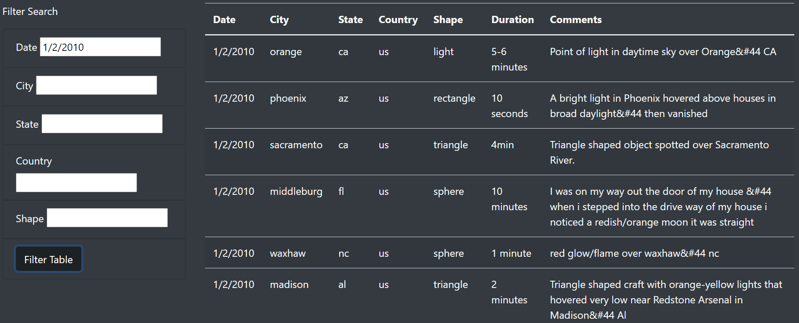
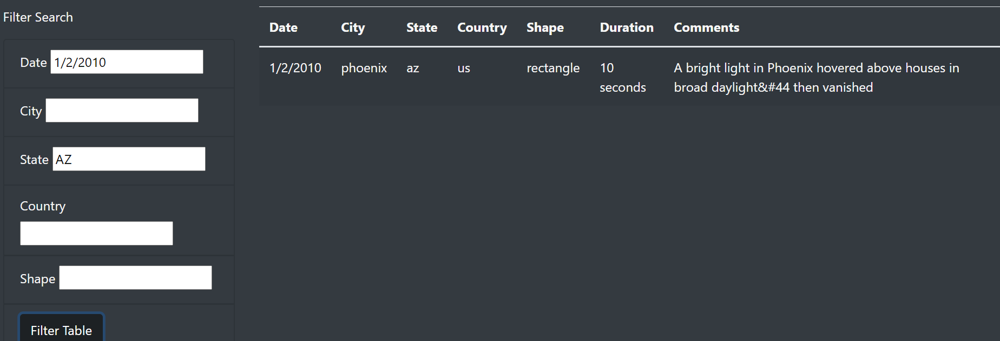
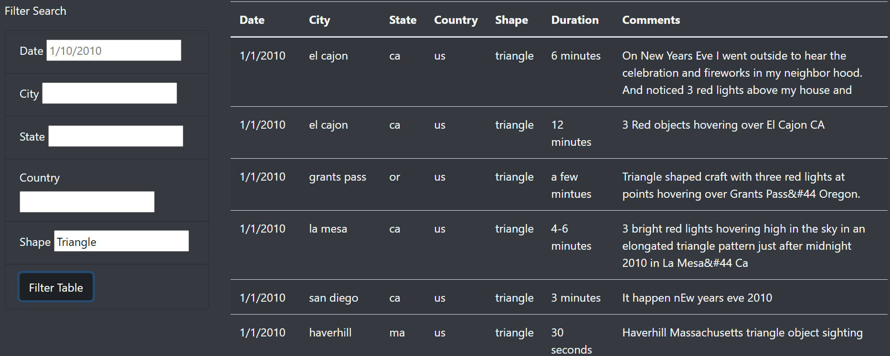
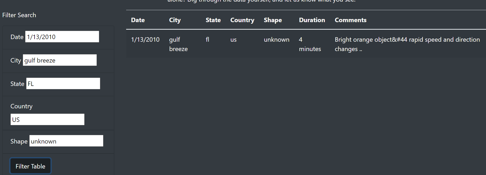

# UFOs
Module 11 challenge
### Summary
The observations according to data by UFO-enthusiast and amateur ufologist that shows people have reported UFO activities. Data shows several different cities in US people have reported these kind of activities.
We have used JavaScript, HTML and CSS combination to represent the data that could be viewed using filters.
According to data people who have reported UFO activities were related to bright lights and shapes in the sky.
#### Filters
Data can be finter using Date, City, State, Country, and Shape.
#### Filter data using to date:

#### Filter data using date and state

#### Filter data using shape

#### Filter data using all filters

